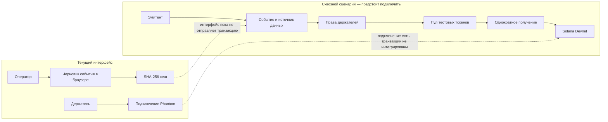

# BondFlow — корпоративные действия для токенизированных облигаций

> Прототип показывает, как описать купонное событие, проверить право держателя на выплату и зафиксировать выплату тестовых токенов в Solana.

[Репозиторий](https://github.com/diaserzanov5-ship-it/BondFlow) · [Хакатон Superteam Kazakhstan × KASE](https://superteam.fun/earn/listing/superteam-kazakhstan-x-kase-side-track-corporate-actions-on-blockchain)

---

## О проекте

BondFlow — прототип для сценария корпоративных действий с облигациями: эмитент объявляет событие, например выплату купона, формирует список получателей, а держатель получает причитающуюся ему сумму.

Проект готовится для сайд-трека Superteam Kazakhstan × KASE, посвящённого корпоративным действиям на блокчейне. Сейчас это демонстрационный MVP: интерфейс и Solana-программа существуют отдельно, а сквозная транзакция между ними ещё не подключена.

## Проблема и решение

### 1. Событие и подтверждающие данные

- **Проблема:** участникам нужно понимать, какое событие объявлено и к каким данным оно относится.
- **BondFlow:** черновик события приводится к упорядоченному формату, а его SHA-256 хеш можно использовать как компактный идентификатор для проверки целостности описания.

### 2. Список прав на выплату

- **Проблема:** размер выплаты зависит от права конкретного держателя, и список получателей должен быть учтён.
- **BondFlow:** проектируемая программа позволяет записать право кошелька на выплату и проверить, что пул покрывает все зарегистрированные суммы.

### 3. Получение выплаты

- **Проблема:** нужно исключить повторное получение одной и той же выплаты.
- **BondFlow:** в сценарии программы держатель сам вызывает получение, а отдельная запись фиксирует, что право уже использовано.

## Как работает демо

1. Оператор открывает демонстрационное купонное событие или создаёт черновик в браузере.
2. Для черновика интерфейс рассчитывает SHA-256 хеш описания.
3. Пользователь может подключить кошелёк Phantom.
4. Anchor-программа содержит инструкции для создания события, регистрации прав, пополнения пула, открытия выплат и получения токенов.

**Текущая граница MVP:** интерфейс пока не отправляет транзакции в программу. Подключение Phantom демонстрирует соединение с кошельком; само по себе оно не означает, что выплата проходит в блокчейне.

## Почему Solana

- **Публичная проверяемость:** статус события и факт получения можно представить в виде записей программы.
- **Программируемые правила:** право на выплату и запрет повторного получения задаются логикой смарт-контракта.
- **Низкие комиссии и быстрые подтверждения:** подходят для интерактивного демонстрационного сценария с множеством держателей.

## Основные возможности и статус

| Возможность | Статус |
| --- | --- |
| Демонстрационный экран купонного события | Реализован в интерфейсе |
| Создание локального черновика события | Реализовано; хранится в браузере |
| Расчёт SHA-256 для описания черновика | Реализован на стороне интерфейса |
| Подключение Phantom | Реализовано для демонстрации |
| Anchor-инструкции для события, прав, пополнения и выплаты | Описаны в исходном коде программы; сборка и проверка в Devnet ещё не подтверждены |
| Связь интерфейса со смарт-контрактом | В работе |
| Выплата токенов в Devnet | Ещё не реализована в сквозном сценарии |
| Интеграция с KASE и реальные ценные бумаги | Не реализована |

## Технологии

| Слой | Технологии |
| --- | --- |
| Интерфейс | React · TypeScript · Vite |
| Кошелёк | Phantom |
| Solana-программа | Rust · Anchor · SPL Token Interface |
| Хеширование черновика | Web Crypto API · SHA-256 |

## Архитектура



В архитектуре программы предусмотрено хранение хеша описания события без самих документов и персональных данных. Сейчас хеширование черновика выполняется в браузере; передача этого значения в Anchor-программу ещё не подключена.

## Быстрый запуск интерфейса

### Требования

- Node.js и npm
- Современный браузер

### Запуск

```powershell
cd apps/web
npm install
npm run dev
```

Vite покажет локальный адрес приложения в терминале. Интерфейс запускается в демо-режиме и не требует Solana CLI или Anchor CLI.

### Сборка интерфейса

Из корня репозитория:

```powershell
npm install
npm run build
```

## Деплой на Vercel

В корне репозитория настроен `vercel.json`: зависимости устанавливаются из `apps/web`, фронтенд собирается командой Vite, а готовые файлы берутся из `apps/web/dist`.

1. Импортируйте GitHub-репозиторий `diaserzanov5-ship-it/BondFlow` в Vercel.
2. Оставьте **Root Directory** корнем репозитория (`.`), чтобы Vercel применил корневой `vercel.json`.
3. Создайте проект и запустите первый деплой. Последующие push в `main` будут запускать новый деплой.

Для текущего демо переменные окружения не требуются: интерфейс работает на демонстрационных данных и пока не подключён к Solana-программе. Переменные из `apps/web/.env.example` сейчас не читаются интерфейсом. Если `VITE_` переменные будут подключены к клиентскому коду, их значения попадут в браузерную сборку — не храните в них секреты.

### Solana-программа

Исходник Anchor находится в `programs/bondflow/src/lib.rs`. Для локальной сборки программы потребуются Rust, Solana CLI и Anchor CLI. Инструкции программы:

1. `create_action` — создать событие и его состояние.
2. `register_entitlement` — записать право кошелька на сумму выплаты.
3. `fund_action` — пополнить пул токенами через Token Program.
4. `open_claims` — открыть выплаты, когда средств хватает на зарегистрированные права.
5. `claim` — перевести держателю сумму и записать факт получения.

Сборка, развёртывание в Devnet и интеграция интерфейса с программой ещё не подтверждены.

## План разработки

- [x] Создать структуру веб-интерфейса и Anchor-программы.
- [x] Подготовить демонстрационный экран и локальные черновики с SHA-256.
- [x] Добавить демонстрационное подключение Phantom.
- [ ] Собрать и проверить Anchor-программу.
- [ ] Развернуть программу в Solana Devnet.
- [ ] Подключить интерфейс к инструкциям программы.
- [ ] Провести сквозную демонстрацию регистрации права и однократного получения тестовых токенов.

## Ограничения демо

- Все события, балансы и обозначение `TEST-KZT` демонстрационные.
- Нет подключения к данным или инфраструктуре KASE.
- Нет реальных ценных бумаг, денежных средств или выплат.
- Не загружайте в демо персональные данные и конфиденциальные документы.

## Полезные ссылки

- [Хакатон Superteam Kazakhstan × KASE](https://superteam.fun/earn/listing/superteam-kazakhstan-x-kase-side-track-corporate-actions-on-blockchain)
- [Документация Solana](https://solana.com/docs)
- [Документация Anchor](https://www.anchor-lang.com/docs)

## Лицензия

Лицензия проекта пока не указана.
